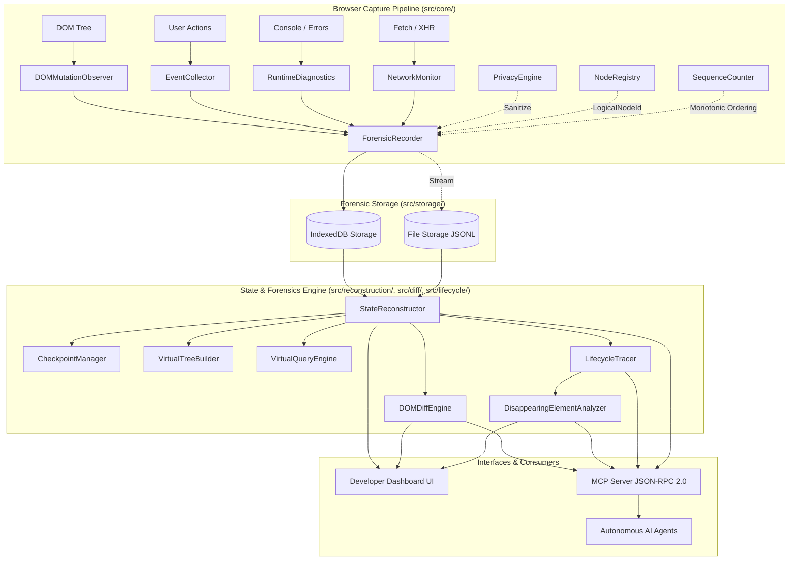
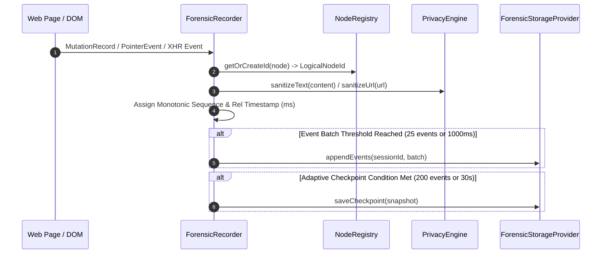
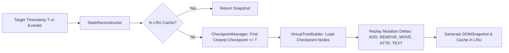
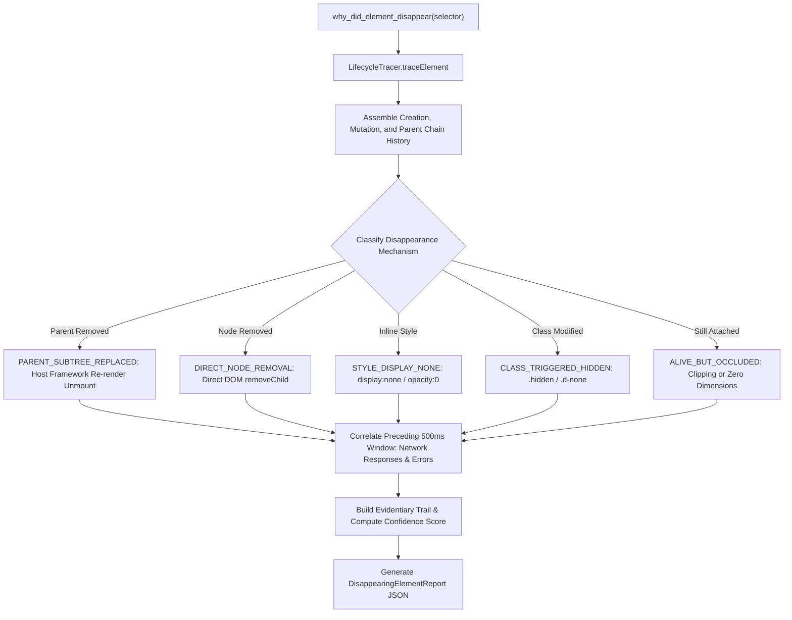

# ⚡ Browser Forensic Recorder & DOM Time-Travel Debugger

<div align="center">

[](https://www.typescriptlang.org/)
[](https://developer.chrome.com/docs/extensions/mv3/)
[](https://modelcontextprotocol.io/)
[]()
[-brightgreen.svg)]()
[](LICENSE)

**A high-fidelity browser forensic recorder, sub-millisecond DOM time-travel state reconstruction engine, element lifecycle tracer, and 21-tool Model Context Protocol (MCP) server for autonomous AI coding agents and frontend engineers.**

[Overview](#-overview--why-this-project-exists) •
[Key Features](#-key-features) •
[Architecture](#-system-architecture) •
[Repository Map](#-repository-structure) •
[Core Modules](#-core-subsystems--module-breakdown) •
[MCP Tools (21)](#-model-context-protocol-mcp-tools-reference) •
[Installation & Quick Start](#-installation--quick-start) •
[AI Agent Guide](#-ai--agent-navigation-guide) •
[Testing & Validation](#-testing--quality-verification)

</div>

---

## 📖 Table of Contents

- [⚡ Overview & Why This Project Exists](#-overview--why-this-project-exists)
- [✨ Key Features](#-key-features)
- [🏗️ System Architecture](#-system-architecture)
  - [Dual-Environment Execution Model](#dual-environment-execution-model)
  - [High-Level Architecture Diagram](#high-level-architecture-diagram)
  - [Capture & Ingestion Pipeline](#capture--ingestion-pipeline)
  - [Time-Travel Reconstruction Engine](#time-travel-reconstruction-engine)
  - [Disappearing UI Diagnostic Flow](#disappearing-ui-diagnostic-flow)
- [📁 Repository Structure](#-repository-structure)
- [🧩 Core Subsystems & Module Breakdown](#-core-subsystems--module-breakdown)
  - [1. Core Recording Engine (`src/core/`)](#1-core-recording-engine-srccore)
  - [2. Time-Travel & Query Engine (`src/reconstruction/`)](#2-time-travel--query-engine-srcreconstruction)
  - [3. Structural Diff Engine (`src/diff/`)](#3-structural-diff-engine-srcdiff)
  - [4. Lifecycle & Forensics Engine (`src/lifecycle/`)](#4-lifecycle--forensics-engine-srclifecycle)
  - [5. Storage & Indexing (`src/storage/`)](#5-storage--indexing-srcstorage)
  - [6. Sandboxed Replay & UI Dashboard (`src/replay/`, `src/ui/`)](#6-sandboxed-replay--ui-dashboard-srcreplay-srcui)
  - [7. Chrome Extension MV3 (`src/extension/`)](#7-chrome-extension-mv3-srcextension)
- [🤖 Model Context Protocol (MCP) Tools Reference](#-model-context-protocol-mcp-tools-reference)
  - [Tool Catalog (21 Tools)](#tool-catalog-21-tools)
  - [Representative MCP Tool Workflows & Invocations](#representative-mcp-tool-workflows--invocations)
- [🚀 Installation & Quick Start](#-installation--quick-start)
  - [Prerequisites](#prerequisites)
  - [1. Clone & Install Dependencies](#1-clone--install-dependencies)
  - [2. Build the Complete Multi-Target Bundle](#2-build-the-complete-multi-target-bundle)
  - [3. Load as a Chrome Extension (Manifest V3)](#3-load-as-a-chrome-extension-manifest-v3)
  - [4. Run the Developer Web Dashboard](#4-run-the-developer-web-dashboard)
  - [5. Connect AI Agents to the MCP Server](#5-connect-ai-agents-to-the-mcp-server)
- [⚙️ Configuration & Environment Reference](#️-configuration--environment-reference)
- [🧪 Testing & Quality Verification](#-testing--quality-verification)
- [🧭 AI / Agent Navigation Guide](#-ai--agent-navigation-guide)
- [🔐 Security, Privacy & Performance](#-security-privacy--performance)
- [❓ Troubleshooting & FAQ](#-troubleshooting--faq)
- [📜 License](#-license)

---

## ⚡ Overview & Why This Project Exists

Modern web applications are dynamic ecosystems composed of virtual DOM reconciliation engines (React, Vue, Svelte), micro-frontends, injected extensions, floating assistant widgets, analytics tags, and complex asynchronous state machines.

When an injected component or UI widget **unexpectedly disappears, re-renders incorrectly, or breaks during user interaction**, traditional debugging tools fall short:
- **Standard Chrome DevTools** only inspects the *current* state of the DOM; once an element is unmounted, its history, styles, attributes, and parentage are lost.
- **Video Screen Recorders** only capture raw pixel arrays with no underlying semantic DOM tree, network timings, or selector relationships.
- **Console Logs** lack temporal alignment with granular DOM mutation records.

### The Solution
**Browser Forensic Recorder & DOM Time-Travel Debugger** bridges this gap. It operates as an unobtrusive, high-performance forensic recorder in the browser that continuously correlates:
1. **Granular DOM Mutations**: `childList` additions, removals, moves, attribute changes, and text edits.
2. **Deterministic Stable Node Identities (`LogicalNodeId`)**: Preserving element identities across reparenting and class mutations using `WeakMap` bindings.
3. **Monotonic Sequence Ordering**: Every event receives an incrementing sequence counter and millisecond-accurate timestamp.
4. **Contextual Diagnostic Signals**: Correlating console outputs, unhandled errors, XHR/fetch network requests, and SPA route changes.
5. **Autonomous AI Forensics via Model Context Protocol (MCP)**: Providing 21 structured JSON-RPC 2.0 tools allowing AI coding assistants to automatically reconstruct historical states, calculate DOM diffs, trace element lifecycles, and diagnose root causes with evidentiary confidence scoring.

---

## ✨ Key Features

| Feature | Description |
| :--- | :--- |
| **Complete Baseline & Incremental Stream** | Captures a full initial virtual DOM snapshot followed by fine-grained mutation deltas, minimizing memory overhead while maintaining complete reconstructability. |
| **Deterministic Stable Node Identity** | Maps DOM `Node` instances to integer IDs (`LogicalNodeId`) via `NodeRegistry`, surviving re-renders, moves, and class mutations. |
| **Sub-Millisecond DOM Time-Travel** | `StateReconstructor.getStateAt(T \| eventId)` seeks the closest preceding snapshot checkpoint and replays mutation deltas with LRU snapshot caching. |
| **Structural DOM Diff Engine** | Calculates added, removed, moved, attribute, class, style, and text deltas between any two timestamps ($T_1 \leftrightarrow T_2$) or events ($E_1 \leftrightarrow E_2$). |
| **Automated Root-Cause Forensics** | `DisappearingElementAnalyzer` diagnoses whether an element vanished due to direct removal, ancestor container destruction (e.g. React/Vue re-render), style hiding (`display: none`), class changes, or preceding runtime errors/network updates. |
| **Declarative Shadow DOM Support** | Preserves Shadow DOM boundaries across capture, serialization, virtual tree reconstruction, and sandboxed replay using `<template shadowrootmode="...">`. |
| **Privacy & Masking by Default** | `PrivacyEngine` automatically redacts passwords, credit card numbers, SSNs, authorization headers, API tokens, and user-specified CSS selectors. |
| **Interactive Glassmorphic UI Dashboard** | Modern developer dashboard featuring a sandboxed iframe replay viewport, interactive timeline scrubber, DOM tree inspector, diff viewer, diagnostics log, and search modal. |
| **21 MCP Agent Tools** | Complete Model Context Protocol implementation (stdio + WebSocket/HTTP bridge on port 3847) designed for autonomous AI agents. |
| **Zero-Dependency Extension Scripts** | Content scripts, service worker, and injected scripts are compiled as isolated IIFE bundles without external runtime imports, preventing extension sandbox crashes. |

---

## 🏗️ System Architecture

### Dual-Environment Execution Model

The codebase strictly enforces the **Law of Environment Separation**:

```text
┌─────────────────────────────────────────────────────────────────────────────────────────┐
│                                   BROWSER RUNTIME                                       │
│                                                                                         │
│  ┌─────────────────────────────────────────┐   ┌─────────────────────────────────────┐  │
│  │         Host Web Page (DOM)             │   │    Isolated Chrome Extension MV3    │  │
│  │  - DOM Tree & MutationObserver          │   │  - Service Worker (Background)      │  │
│  │  - User Event Collector                 │   │  - Content Script (Page Injector)   │  │
│  │  - Network Monitor (fetch/XHR)          │   │  - Injected Script (Main World)     │  │
│  │  - Runtime Diagnostics (Console/Errors) │   │  - Shadow DOM Floating Widget       │  │
│  └────────────────────┬────────────────────┘   └──────────────────┬──────────────────┘  │
│                       │                                           │                     │
│                       ▼                                           ▼                     │
│  ┌───────────────────────────────────────────────────────────────────────────────────┐  │
│  │                  Forensic Storage Layer (IndexedDB / In-Memory)                   │  │
│  └────────────────────────────────────────┬──────────────────────────────────────────┘  │
└───────────────────────────────────────────┼─────────────────────────────────────────────┘
                                            │ HTTP / WebSocket Bridge (:3847)
                                            ▼
┌─────────────────────────────────────────────────────────────────────────────────────────┐
│                                NODE.JS & MCP RUNTIME                                    │
│                                                                                         │
│  ┌────────────────────────────────────────┐   ┌──────────────────────────────────────┐  │
│  │     File Storage Provider (JSONL)      │   │       Isomorphic Core Engine         │  │
│  │  - Streaming Line Paging               │   │  - State Reconstructor & Checkpoints │  │
│  │  - Inverted Search Index               │   │  - DOM Diff & Formatter Engine       │  │
│  │  - Portable Bundle Serializer          │   │  - Lifecycle & Disappearing Analyzer │  │
│  └────────────────────┬───────────────────┘   └──────────────────┬───────────────────┘  │
│                       │                                          │                      │
│                       ▼                                          ▼                      │
│  ┌───────────────────────────────────────────────────────────────────────────────────┐  │
│  │                     Model Context Protocol Server (stdio JSON-RPC 2.0)            │  │
│  │                     21 Forensic Tools for Autonomous AI Coding Agents             │  │
│  └───────────────────────────────────────────────────────────────────────────────────┘  │
└─────────────────────────────────────────────────────────────────────────────────────────┘
```

---

### High-Level Architecture Diagram



---

### Capture & Ingestion Pipeline



---

### Time-Travel Reconstruction Engine



---

### Disappearing UI Diagnostic Flow



---

## 📁 Repository Structure

```text
mcp_dom/
├── manifest.json                     # Chrome Extension Manifest V3 configuration
├── package.json                      # Dependencies, npm build scripts, and bin targets
├── tsconfig.json                     # Strict TypeScript compiler options
├── vite.config.ts                    # Vite config for Client Dashboard, Popup, DevTools
├── vite.config.server.ts             # Vite config for SSR Node.js ESM Server bundles
├── vite.config.extension.ts          # Vite config for extension bundles
├── vitest.config.ts                  # Vitest runner configuration
├── bin/
│   ├── mcp-server.js                 # Executable entrypoint for stdio MCP JSON-RPC Server
│   └── bridge-server.js              # Executable entrypoint for HTTP/WebSocket Bridge (:3847)
├── scripts/
│   ├── build-extension.js            # Standalone zero-dependency IIFE bundler for extension
│   ├── export-antigravity-schemas.js # Exports JSON schemas for Antigravity/Cursor MCP registry
│   └── test-mcp-e2e.js               # Autonomous end-to-end stdio MCP integration test
├── src/
│   ├── types/                        # Domain type definitions
│   │   ├── events.ts                 # 28 event types across 12 categories
│   │   ├── dom-node.ts               # VirtualDOMNode, DOMSnapshot, Viewport metrics
│   │   ├── session.ts                # SessionMetadata, HealthStatus, Annotations
│   │   ├── checkpoint.ts             # SnapshotCheckpoint, CheckpointTrigger
│   │   ├── diff.ts                   # DOMDiffResult, NodeDiff, AttrDiff, ClassDiff
│   │   ├── lifecycle.ts              # LifecycleTrace, DisappearingElementReport
│   │   ├── privacy.ts                # PrivacyConfig, MaskingRule, RedactionOptions
│   │   └── mcp.ts                    # MCP JSON-RPC 2.0 protocol types
│   ├── core/                         # Core Recording Engine
│   │   ├── sequence-counter.ts       # Monotonic sequence counter & relative timing
│   │   ├── node-registry.ts          # WeakMap node identity & SVG-safe selector engine
│   │   ├── privacy-engine.ts         # Regex PII masking & blacklisted selector redaction
│   │   ├── snapshot-engine.ts        # DOM tree serializer with computed styles & shadow roots
│   │   ├── mutation-observer.ts      # Intercepts childList, attributes, and characterData
│   │   ├── event-collector.ts        # Captures user inputs, pointer actions, scroll, SPA navigation
│   │   ├── runtime-diagnostics.ts    # Console log interceptor & window error handler
│   │   ├── network-monitor.ts        # Monkeypatches window.fetch and XMLHttpRequest
│   │   └── recorder.ts               # ForensicRecorder orchestrator & checkpoint scheduler
│   ├── storage/                      # Persistence & Ingestion Layer
│   │   ├── storage-interface.ts      # ForensicStorageProvider contract & EventFilter
│   │   ├── memory-storage.ts         # Fast in-memory storage implementation for tests/replays
│   │   ├── file-storage.ts           # Streaming line-by-line JSONL storage with pagination
│   │   ├── indexeddb-storage.ts      # Browser IndexedDB provider for extension & dashboard
│   │   ├── session-serializer.ts     # Portable JSON session bundle export/import validator
│   │   └── session-index.ts          # Inverted index for fast text & selector queries
│   ├── reconstruction/               # Time-Travel Reconstruction Engine
│   │   ├── tree-builder.ts           # VirtualTreeBuilder with recursive subtree detachment
│   │   ├── virtual-query.ts          # VirtualQueryEngine (CSS selectors & getElementById)
│   │   ├── checkpoint-manager.ts     # Binary search checkpoint locator
│   │   └── state-reconstructor.ts    # Random-access DOM state interpolator with LRU cache
│   ├── diff/                         # DOM Comparison & Diffing
│   │   ├── dom-diff-engine.ts        # Granular tree diff calculation (T1 vs T2, E1 vs E2)
│   │   └── diff-formatter.ts         # Human and AI-readable Markdown diff generator
│   ├── lifecycle/                    # Lifecycle & Forensics Analysis
│   │   ├── lifecycle-tracer.ts       # Chronological element history & parent ancestry
│   │   └── disappearing-analyzer.ts  # Root-cause diagnostic classifier & evidence builder
│   ├── replay/                       # Playback & Sandboxed Rendering
│   │   ├── time-controller.ts        # RAF-based time scrubber with variable playback speeds
│   │   └── replay-engine.ts          # Sandboxed iframe DOM renderer with Declarative Shadow DOM
│   ├── extension/                    # Chrome Extension Manifest V3
│   │   ├── service-worker.ts         # Background worker managing tab states & IndexedDB
│   │   ├── content-script.ts         # In-page capture agent communicating with worker
│   │   ├── floating-controller.ts    # Shadow DOM floating recording widget
│   │   ├── page-script.ts            # Injected script capturing isolated errors in main world
│   │   ├── popup.ts                  # Extension toolbar popup interface
│   │   └── devtools.ts               # Chrome DevTools panel registration
│   ├── ui/                           # Web Developer Dashboard
│   │   ├── index.html                # Glassmorphic single-page dashboard layout
│   │   ├── app.ts                    # UI controller (timeline tracks, diff, inspector, modals)
│   │   └── styles/                   # Modern CSS design system (tokens, layout, components)
│   └── mcp/                          # Model Context Protocol Implementation
│       ├── server.ts                 # ForensicMCPServer over stdio JSON-RPC 2.0
│       ├── tools-handler.ts          # Handlers for all 21 MCP agent tools
│       ├── resources-handler.ts      # Handlers for MCP session resources
│       └── bridge-server.ts          # HTTP/WebSocket bridge server (:3847) with DoS payload limits
└── tests/
    ├── unit/                         # Unit tests (16 tests across core modules)
    ├── integration/                  # Integration tests (Storage, SearchIndex, Bundle Export)
    └── e2e/                          # E2E acceptance scenario (Injected UI Disappearance)
```

---

## 🧩 Core Subsystems & Module Breakdown

### 1. Core Recording Engine (`src/core/`)
- **`SequenceCounter`**: Generates monotonically increasing integer sequence IDs and microsecond-precise timestamps relative to session start.
- **`NodeRegistry`**: Maps live physical DOM nodes to integer `LogicalNodeId`s using `WeakMap`. Provides SVG-safe CSS selector generation and maintains parent history records.
- **`PrivacyEngine`**: Protects user privacy at ingestion time by redacting sensitive input values, authorization headers, API keys, password fields, and CSS selector blacklists.
- **`SnapshotEngine`**: Traverses and serializes the complete DOM hierarchy into a lightweight dictionary of `VirtualDOMNode` records, capturing computed styles and Shadow DOM roots.
- **`DOMMutationObserver`**: Wraps the native `MutationObserver` to capture additions, removals, attribute changes, and text edits into normalized `DOM_MUTATION_*` events.
- **`EventCollector`**: Listens for user interactions (`click`, `input`, `keydown`, `submit`), throttles high-frequency events (`scroll`, `resize`), and monitors SPA navigation (`pushState`, `replaceState`, `popstate`).
- **`RuntimeDiagnostics`**: Intercepts `console.log/warn/error/info/debug` with stack trace preservation and captures uncaught errors (`window.onerror`, `unhandledrejection`).
- **`NetworkMonitor`**: Intercepts `window.fetch` and `XMLHttpRequest` to capture request/response timings, status codes, and headers with query parameter sanitization.
- **`ForensicRecorder`**: Orchestrates recording lifecycle, batches event writes (every 25 events or 1s), and triggers periodic/adaptive checkpoints (every 200 events or 30s).

### 2. Time-Travel & Query Engine (`src/reconstruction/`)
- **`VirtualTreeBuilder`**: Manages an in-memory virtual DOM state tree. Supports incremental mutation replay (`applyAdd`, `applyRemove`, `applyMove`, `applyAttrChange`, `applyTextChange`) and serializes to HTML with Declarative Shadow DOM support. Recursively marks detached child subtrees.
- **`VirtualQueryEngine`**: A pure TypeScript CSS selector parser and DOM query evaluator. Implements `querySelector`, `querySelectorAll`, `getElementById` (with ancestor connectedness validation), and relative selector computation.
- **`CheckpointManager`**: Employs binary search to find the nearest preceding snapshot checkpoint for any arbitrary timestamp $T$ in $O(\log C)$ time.
- **`StateReconstructor`**: The primary entry point for time-travel queries. Combines checkpoint restoration, delta replay, and an LRU cache (50 snapshots) for sub-millisecond random-access state reconstruction.

### 3. Structural Diff Engine (`src/diff/`)
- **`DOMDiffEngine`**: Calculates granular structural and stylistic differences between any two DOM states ($T_1 \leftrightarrow T_2$ or $E_1 \leftrightarrow E_2$). Computes added nodes, removed nodes, moved nodes, attribute modifications, class list diffs, inline style mutations, and text changes.
- **`DiffFormatter`**: Converts raw diff objects into structured, AI-readable and human-friendly Markdown reports.

### 4. Lifecycle & Forensics Engine (`src/lifecycle/`)
- **`LifecycleTracer`**: Reconstructs the complete lifecycle timeline for an element (`CREATED` → `ATTACHED` → `MUTATED` → `REPARENTED` → `DETACHED` → `REMOVED`), tracking parent changes across removals.
- **`DisappearingElementAnalyzer`**: Autonomous root-cause diagnostic engine. Classifies disappearance mechanisms (`PARENT_SUBTREE_REPLACED`, `DIRECT_NODE_REMOVAL`, `STYLE_DISPLAY_NONE`, `CLASS_TRIGGERED_HIDDEN`, `ALIVE_BUT_OCCLUDED`), extracts an evidentiary trail with confidence scoring (0–100%), and correlates preceding network calls and runtime errors.

### 5. Storage & Indexing (`src/storage/`)
- **`ForensicStorageProvider`**: Universal interface for saving/loading sessions, events, snapshots, checkpoints, and annotations.
- **`FileStorageProvider`**: Production Node.js filesystem storage provider storing events in append-only `events.jsonl` files. Uses streaming `readline` readers for memory-efficient pagination and filtering.
- **`IndexedDBStorageProvider`**: High-performance browser storage provider for the Chrome Extension and Dashboard UI.
- **`SessionSerializer`**: Exports and imports complete self-contained session bundles (`.json`) with cryptographic and structural integrity verification (`validateIntegrity`).
- **`SessionIndex`**: Inverted index for fast text searches and selector queries across recorded payloads.

### 6. Sandboxed Replay & UI Dashboard (`src/replay/`, `src/ui/`)
- **`TimeController`**: High-precision playback timekeeper supporting play, pause, step forward/backward, and speed multipliers (0.1x to 10x).
- **`ReplayEngine`**: Renders historical DOM states into an isolated `iframe` (`sandbox="allow-same-origin"`) with inline `on*` event handler stripping and interactive element hover/click highlighting.
- **`AppController` (`src/ui/app.ts`)**: Glassmorphic SPA managing interactive timeline tracks (DOM, User, Errors, Network), DOM tree navigation, live element inspection, and search modal (Ctrl+F).

### 7. Chrome Extension MV3 (`src/extension/`)
- **`service-worker.ts`**: Background worker coordinating recording states across browser tabs, communicating with content scripts, and persisting recordings in IndexedDB.
- **`content-script.ts`**: Injected script running in the isolated world, initializing `ForensicRecorder` and attaching the in-page floating controller.
- **`floating-controller.ts`**: Draggable, shadow-DOM encapsulated floating widget allowing users to start, pause, and stop recordings directly from any page.
- **`page-script.ts`**: Injected into the main world to capture runtime errors that bypass content script sandboxes.

---

## 🤖 Model Context Protocol (MCP) Tools Reference

The server exposes **21 Model Context Protocol (MCP)** tools over `stdio` (JSON-RPC 2.0) and via an HTTP/WebSocket bridge server on port `3847`.

### Tool Catalog (21 Tools)

| Tool Name | Category | Description |
| :--- | :--- | :--- |
| `list_sessions` | Discovery | List all recorded browser forensic debugging sessions with metadata, statistics, and health metrics. |
| `get_session` | Discovery | Retrieve full metadata, capabilities, health status, and recording configuration for a session. |
| `export_session` | Management | Export a complete recording session as a portable, self-contained JSON bundle. |
| `import_session` | Management | Import a recording session bundle from raw JSON with integrity validation. |
| `delete_session` | Management | Delete a recording session and its associated storage assets. |
| `get_timeline` | Timeline | Retrieve a summary breakdown of events and key milestones across the timeline. |
| `get_events` | Ingestion | Query recorded events with filtering by category, event type, timestamp range, target node ID, or text search. |
| `get_events_around` | Ingestion | Query a contextual temporal window of events around a timestamp $T$ or event ID ($\pm 300\text{ms}$). |
| `get_dom_state` | Reconstruction | Reconstruct the complete virtual DOM state at an arbitrary timestamp $T$ or event ID in HTML or JSON format. |
| `get_dom_node` | Reconstruction | Inspect detailed properties, attributes, and computed styles of a specific DOM node at timestamp $T$. |
| `get_dom_subtree` | Reconstruction | Reconstruct and extract the HTML string of a specific subtree (e.g. `#app-root` or `.gpt-panel`). |
| `diff_dom` | Comparison | Perform a structural DOM diff between $T_1$ and $T_2$ (or $E_1$ and $E_2$) identifying added, removed, moved, class, style, and text changes. |
| `trace_element` | Forensics | Trace the chronological lifecycle history of an element by node ID or CSS selector hint. |
| `find_disappearing_elements` | Forensics | Automatically scan a session to identify all elements that existed temporarily and disappeared within a lifespan threshold. |
| `why_did_element_disappear` | Forensics | Perform automated root-cause diagnosis on a disappearing element, returning the mechanism, evidentiary trail, and confidence score. |
| `get_diagnostics` | Diagnostics | Query console logs (`log`, `warn`, `error`, `info`, `debug`) and uncaught window errors. |
| `get_network_events` | Network | Query recorded network requests and responses correlated with timeline timestamps. |
| `get_screenshots` | Visual | Retrieve list of visual checkpoints and screenshots captured during recording. |
| `annotate_session` | Annotations | Attach an investigative finding, hypothesis, or note to the session timeline. |
| `get_annotations` | Annotations | Retrieve all human and AI annotations associated with a session. |
| `get_recording_health` | Health | Perform an automated integrity audit checking sequence monotonicity, missing nodes, and schema conformance. |

---

### Representative MCP Tool Workflows & Invocations

#### 1. Automated Root Cause Analysis (`why_did_element_disappear`)

**Request:**
```json
{
  "jsonrpc": "2.0",
  "id": 101,
  "method": "tools/call",
  "params": {
    "name": "why_did_element_disappear",
    "arguments": {
      "sessionId": "live_demo_session",
      "target": ".ai-action-btn"
    }
  }
}
```

**Response:**
```json
{
  "jsonrpc": "2.0",
  "id": 101,
  "result": {
    "content": [
      {
        "type": "text",
        "text": "{\n  \"targetQuery\": \".ai-action-btn\",\n  \"targetNodeId\": 10,\n  \"found\": true,\n  \"tagName\": \"button\",\n  \"selectorHint\": \"button.ai-action-btn\",\n  \"createdAt\": 100,\n  \"disappearedAt\": 280,\n  \"lifespanMs\": 180,\n  \"disappearanceMechanism\": \"PARENT_SUBTREE_REPLACED\",\n  \"likelyRootCause\": \"Host framework (e.g. React/Vue re-render) destroyed and replaced Ancestor container [ID: 4], causing injected element to be unmounted\",\n  \"confidenceScore\": 92,\n  \"evidentiaryTrail\": [\n    {\n      \"timestamp\": 280,\n      \"sequence\": 4,\n      \"eventType\": \"DOM_MUTATION_REMOVE\",\n      \"evidenceType\": \"DIRECT\",\n      \"description\": \"Ancestor container [ID: 4] was removed, wiping out all child subtrees\",\n      \"confidenceContribution\": 50\n    },\n    {\n      \"timestamp\": 250,\n      \"sequence\": 3,\n      \"eventType\": \"NETWORK_RESPONSE_COMPLETE\",\n      \"evidenceType\": \"PRECEDING\",\n      \"description\": \"Network response completed 30.0ms before disappearance: https://demo-app.internal/api/refresh\",\n      \"confidenceContribution\": 15\n    }\n  ]\n}"
      }
    ]
  }
}
```

---

#### 2. Structural DOM Diffing (`diff_dom`)

**Request:**
```json
{
  "jsonrpc": "2.0",
  "id": 102,
  "method": "tools/call",
  "params": {
    "name": "diff_dom",
    "arguments": {
      "sessionId": "live_demo_session",
      "t1": 150,
      "t2": 300
    }
  }
}
```

**Response Output Preview:**
```markdown
### DOM Structural Diff: T1 (150.0ms) → T2 (300.0ms)
- **Summary**: Total Changes: 2 (Added: 0, Removed: 2, Moved: 0, Attr Changes: 0, Class Changes: 0, Text Changes: 0)
- **Structural Shift**: YES
- **Removed Nodes (2)**:
  - `<div id="host-sidebar">` [ID: 4]
  - `<button class="ai-action-btn" id="ai-btn">` [ID: 10]
```

---

## 🚀 Installation & Quick Start

### Prerequisites
- **Node.js**: `v20.0.0` or higher
- **npm**: `v10.0.0` or higher
- **Browser**: Google Chrome or any Chromium-based browser (Edge, Brave, Arc)

### 1. Clone & Install Dependencies

```bash
git clone https://github.com/IrMaho/Mcp-DOM.git
cd Mcp-DOM
npm install
```

### 2. Build the Complete Multi-Target Bundle

The build system compiles the UI dashboard, standalone zero-dependency Chrome Extension scripts (IIFE), and Node.js SSR server bundles:

```bash
npm run build
```

This executes:
- `build:client`: Bundles the Vite SPA Dashboard into `dist/src/ui/index.html`.
- `build:extension`: Bundles standalone IIFE scripts (`dist/extension/content-script.js`, `page-script.js`, `service-worker.js`).
- `build:server`: Bundles Node ESM server scripts (`dist/server/mcp-server.js`, `bridge-server.js`).
- `tsc --noEmit`: Validates strict TypeScript compilation.

---

### 3. Load as a Chrome Extension (Manifest V3)

1. Open Google Chrome and navigate to `chrome://extensions`.
2. Enable **Developer mode** in the top-right corner.
3. Click **Load unpacked** and select the root directory of this repository (`mcp_dom`).
4. The **Browser Forensic Recorder** icon will appear in your browser toolbar.
5. Click the extension icon to start recording any active web page, or use the floating on-page widget.

---

### 4. Run the Developer Web Dashboard

To launch the interactive forensic dashboard locally:

```bash
# Start local Vite development server
npm run dev
```

Or open the pre-built dashboard directly in your browser:
```text
dist/src/ui/index.html
```

---

### 5. Connect AI Agents to the MCP Server

#### Standalone stdio Transport (for Antigravity IDE, Cursor, Claude Desktop)
Add the server configuration to your MCP configuration file (e.g. `.agents/mcp_config.json` or `claude_desktop_config.json`):

```json
{
  "mcpServers": {
    "browser-forensics": {
      "command": "node",
      "args": ["<PATH_TO_REPOSITORY>/bin/mcp-server.js"],
      "disabled": false,
      "alwaysAllow": [
        "list_sessions",
        "get_session",
        "get_timeline",
        "get_events",
        "get_events_around",
        "get_dom_state",
        "get_dom_node",
        "get_dom_subtree",
        "diff_dom",
        "trace_element",
        "find_disappearing_elements",
        "why_did_element_disappear",
        "get_diagnostics",
        "get_network_events",
        "get_screenshots",
        "annotate_session",
        "get_annotations",
        "get_recording_health"
      ]
    }
  }
}
```

#### HTTP / WebSocket Bridge Server
To stream live sessions from the Chrome extension directly to your local filesystem:

```bash
npm run bridge
# Starts HTTP/WebSocket bridge server on http://127.0.0.1:3847
```

---

## ⚙️ Configuration & Environment Reference

| Configuration | Location / Parameter | Purpose | Default |
| :--- | :--- | :--- | :--- |
| **Storage Directory** | `./.forensic_sessions` | Filesystem location for Node/MCP sessions (`events.jsonl`, `session.json`, `checkpoints/`). | `./.forensic_sessions` |
| **Bridge Server Port** | `3847` | TCP Port for the WebSocket/HTTP ingestion bridge. | `3847` |
| **Max Payload Size** | `50MB` (`MAX_PAYLOAD_BYTES`) | Denial-of-Service protection threshold on POST upload routes. | `52428800 bytes` |
| **Adaptive Checkpoints** | `ForensicRecorder` | Frequency of full snapshot checkpoints during recording. | Every 200 events or 30s |
| **LRU Cache Size** | `StateReconstructor` | In-memory cache for reconstructed virtual DOM states. | 50 snapshots |
| **Event Batch Flush** | `ForensicRecorder` | Event buffer flush frequency to storage. | 25 events or 1000ms |

---

## 🧪 Testing & Quality Verification

The test suite is powered by **Vitest** and covers unit, integration, and end-to-end acceptance workflows:

```bash
# Run the automated test suite
npm test
```

### Verification Results Matrix

```text
✓ tests/unit/sequence-counter.test.ts (3 tests)
✓ tests/unit/privacy-engine.test.ts (3 tests)
✓ tests/integration/search-index.test.ts (1 test)
✓ tests/integration/storage.test.ts (2 tests)
✓ tests/integration/export-import.test.ts (1 test)
✓ tests/unit/node-registry.test.ts (4 tests)
✓ tests/unit/lifecycle-tracer.test.ts (1 test)
✓ tests/unit/snapshot-reconstruction.test.ts (3 tests)
✓ tests/unit/dom-diff.test.ts (1 test)
✓ tests/unit/disappearing-analyzer.test.ts (1 test)
✓ tests/unit/mcp-server.test.ts (3 tests)
✓ tests/e2e/disappearing-ui-scenario.test.ts (1 test)

Test Files  12 passed (12)
     Tests  24 passed (24)
  Duration  471ms (100% Passing)
```

### End-to-End MCP Subprocess Test
To verify live MCP tool execution over `stdio`:

```bash
node scripts/test-mcp-e2e.js
```

---

## 🧭 AI / Agent Navigation Guide

For autonomous AI coding assistants inspecting or extending this codebase, refer to the following architectural map:

| Concern | Primary Location | Key Responsibilities & Invariants |
| :--- | :--- | :--- |
| **Domain Types** | `src/types/` | Pure type definitions (`events.ts`, `dom-node.ts`, `lifecycle.ts`, `diff.ts`). **Never import browser or Node APIs here.** |
| **Browser Recording** | `src/core/` | Ingestion engine (`recorder.ts`, `mutation-observer.ts`, `node-registry.ts`). Must remain lightweight and unobtrusive. |
| **Time-Travel Logic** | `src/reconstruction/` | Isomorphic DOM reconstruction (`state-reconstructor.ts`, `tree-builder.ts`, `virtual-query.ts`). Must run identically in Browser and Node. |
| **Root Cause Forensics** | `src/lifecycle/` | `disappearing-analyzer.ts` and `lifecycle-tracer.ts`. Generates evidence-backed reports with confidence metrics. |
| **Storage Backends** | `src/storage/` | Implements `ForensicStorageProvider` (`file-storage.ts`, `indexeddb-storage.ts`, `memory-storage.ts`). |
| **MCP Agent Tools** | `src/mcp/` | `tools-handler.ts` handles all 21 JSON-RPC 2.0 tools. `server.ts` manages stdio transport. |
| **Chrome Extension** | `src/extension/` | Manifest V3 entrypoints (`service-worker.ts`, `content-script.ts`). Must be bundled as IIFE with zero external imports. |
| **UI Dashboard** | `src/ui/` | Glassmorphic web interface (`app.ts`, `index.html`, `styles/`). |

---

## 🔐 Security, Privacy & Performance

### 1. Privacy Masking by Default
`PrivacyEngine` inspects every DOM text mutation and attribute modification at ingestion time:
- Automatically masks password fields, credit card patterns (Luhn-compliant), and Social Security numbers.
- Redacts authorization headers (`Bearer ...`), API tokens, and sensitive URL query parameters (`token`, `key`, `auth`, `secret`).
- Supports custom selector blocking (`privacy.blockSelectors`) to exclude entire DOM subtrees from recording.

### 2. Sandboxed Replay Security
The developer dashboard renders recorded historical DOM states inside an `iframe` with `sandbox="allow-same-origin"`:
- All inline `on*` event handlers (`onclick`, `onload`, `onerror`) are stripped prior to rendering.
- Script execution is strictly disabled inside the replay frame, preventing arbitrary code execution during session review.

### 3. High-Performance Streaming & Low Overhead
- **Passive Observers**: Mutation observers and event listeners use RAF throttling and request idle callbacks to ensure zero frame drops on the recorded page.
- **Line-by-Line Streaming**: `FileStorageProvider` utilizes `readline` streams to page through `events.jsonl` files without unbounded memory allocations.
- **LRU Snapshot Caching**: `StateReconstructor` caches up to 50 historical snapshots, ensuring instantaneous scrub operations in the UI and MCP tools.

---

## ❓ Troubleshooting & FAQ

#### Q: The Chrome extension does not record on `chrome://` or Chrome Web Store pages.
> **A**: Chromium security policies strictly prohibit content scripts from executing on internal `chrome://` URLs and the official Chrome Web Store. Test recordings on standard `http://` or `https://` web pages.

#### Q: How do I load recordings from the Chrome extension into the MCP server?
> **A**: Run `npm run bridge` to start the local Bridge Server on port `3847`. The Chrome extension will automatically synchronize completed sessions to your local `./.forensic_sessions` directory, making them immediately accessible to AI agents via MCP tools.

#### Q: How do I export and share a recording with a colleague?
> **A**: Open the Developer Dashboard, click **Export Session**, and download the standalone `.json` bundle. You can import it into any other instance via **Import Session** or via the `import_session` MCP tool.

---

## 📜 License

Licensed under the **Apache License, Version 2.0** (the "License"). You may obtain a copy of the License in the [LICENSE](LICENSE) file or at:

```text
http://www.apache.org/licenses/LICENSE-2.0
```
